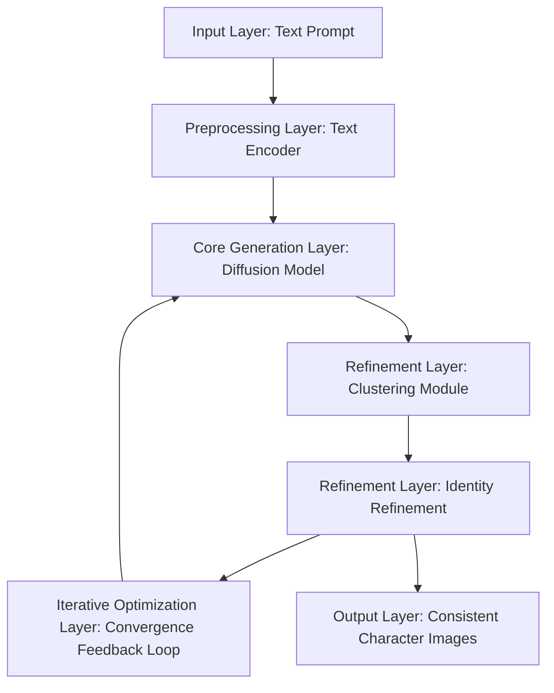

### Architectural Map for Consistent Character Generation in Text-to-Image Diffusion Models

#### **Mermaid Diagram Representation**

#### **Layers Description**

1. **Input Layer**
   - **Input:** Text prompt describing the target character (e.g., *"a ginger cat with a scarf"*).
   - **Module:** Text Encoder (e.g., CLIP or OpenCLIP).
     - Converts the natural language prompt into a high-dimensional embedding.

2. **Preprocessing Layer**
   - **Generated Noise:** Random noise is initialized as the starting point for the diffusion process.
   - **Conditioning:** The text embedding is passed to the diffusion model to guide image generation.

3. **Core Generation Layer**
   - **Diffusion Model:**
     - Model: Stable Diffusion or equivalent pre-trained diffusion model.
     - Process: Gradually removes noise, generating images conditioned on the text embedding.
   - **Output:** A diverse set of images corresponding to the text prompt.

4. **Refinement Layer**
   - **Embedding Extraction:**
     - Feature extractor (e.g., DINOv2) converts generated images into embeddings for clustering.
   - **Clustering Module:**
     - Uses K-Means++ to group embeddings into clusters based on similarity.
     - Identifies the most cohesive cluster to represent the target character.
   - **Identity Refinement:**
     - Refines the diffusion model’s representation of the character using:
       - **LoRA (Low-Rank Adaptation):** Updates model parameters for better alignment.
       - **Textual Inversion:** Creates new text tokens to represent the refined character.

5. **Iterative Optimization Layer**
   - **Process Loop:**
     - Repeat image generation, clustering, and refinement steps.
     - Stop when a convergence criterion (e.g., minimal intra-cluster variation) is met.

6. **Output Layer**
   - **Final Output:** Consistent images of the character in various contexts as defined by the input prompt.

#### **Infrastructure Components**
- **Hardware:**
  - High-performance GPUs (e.g., NVIDIA A100, RTX 3090).
  - Cloud services (e.g., Google Colab, AWS, Azure) for scalability.
- **Software Dependencies:**
  - Diffusion frameworks (e.g., PyTorch, diffusers library).
  - Clustering libraries (e.g., `scikit-learn`).
  - Text embedding tools (e.g., Hugging Face Transformers, DINOv2).

#### **Workflow Summary**
1. Input text prompt is encoded.
2. Diffusion model generates images conditioned on the text embedding.
3. Clustering selects the most cohesive identity representation.
4. Refinement modules fine-tune the model for consistency.
5. The process iterates until convergence.
6. Outputs are generated for diverse scenarios based on the refined character identity.
